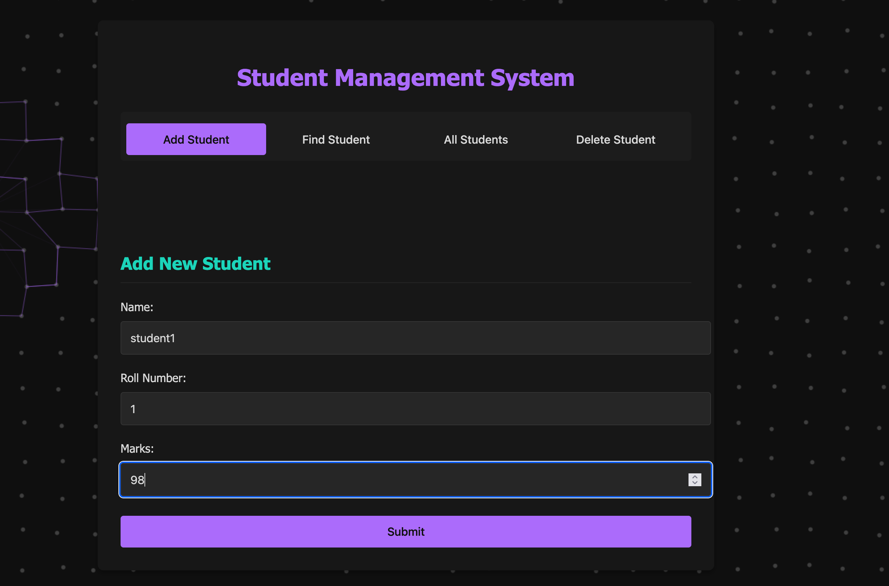
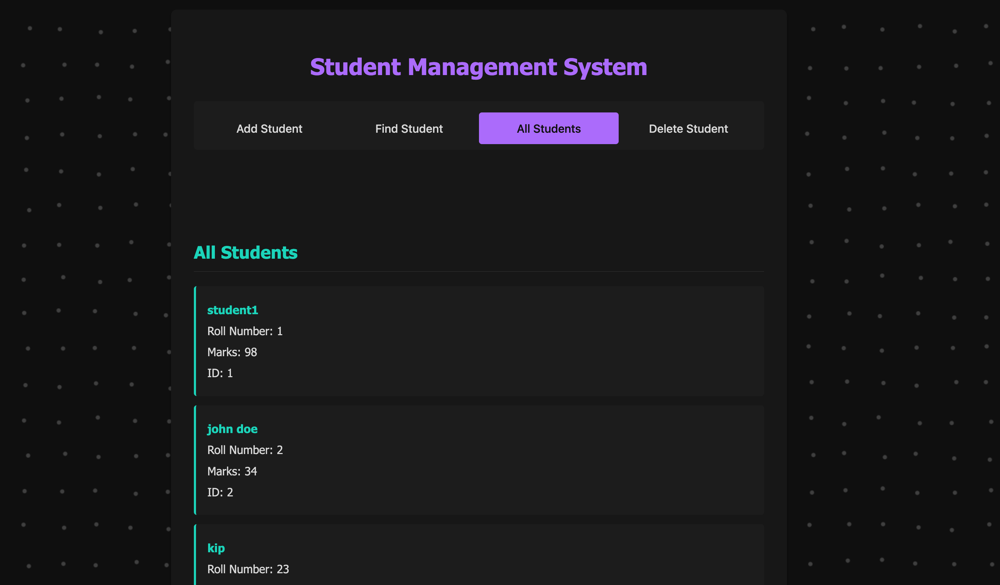
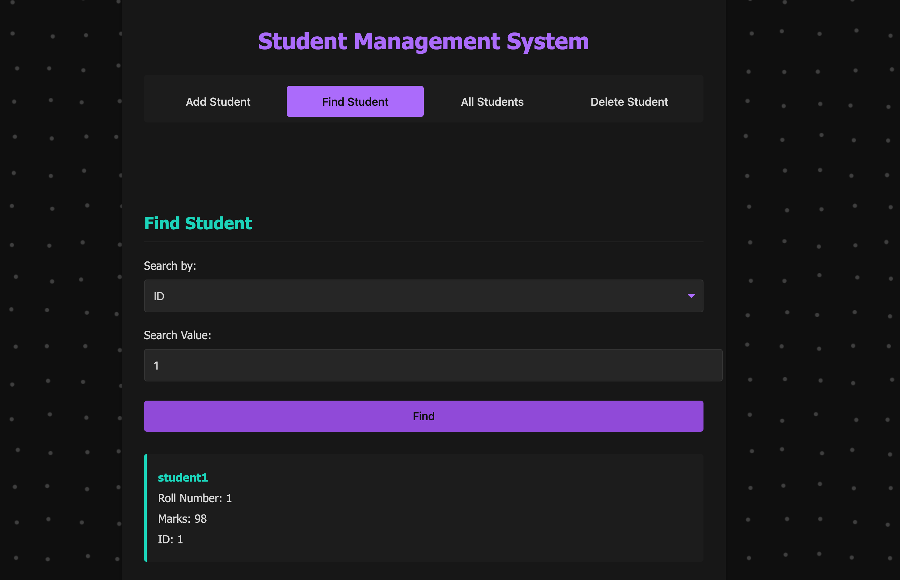

# Spring Boot CRUD Student API

This project is a full-stack student management system built with a **Spring Boot** backend, a **MySQL** database, and an optional **frontend**. It supports basic **CRUD** operations: Create, Read, Update, and Delete.

##  Project Structure

- `backend/`: Spring Boot API for student records
- `frontend/`:  Frontend client 
- `setup.sh`: Script to set up and start both backend and MySQL using Docker

##  Requirements


### 🐳 Docker
1.Docker – to containerize and run MySQL, backend, and optional frontend

2.Docker Compose – used by setup.sh to orchestrate multiple containers

## 🚀 Getting Started

### 1. Clone the Repository

```bash
git clone https://github.com/Ausevx/springboot-crud-studentapi.git
cd springboot-crud-studentapi
 ```        
### 2. Run the Entire Stack
 Run the following command in your terminal:
 ```bash
    ./setup.sh
```
This will:

1.Start a MySQL database in Docker on port 3308

2.Build and run the Spring Boot API on port 8080

3.Launch the frontend  on port 80
   
### Screenshots

1. Add new student.
2. Find all students
3. Find student by ID/Rollno.